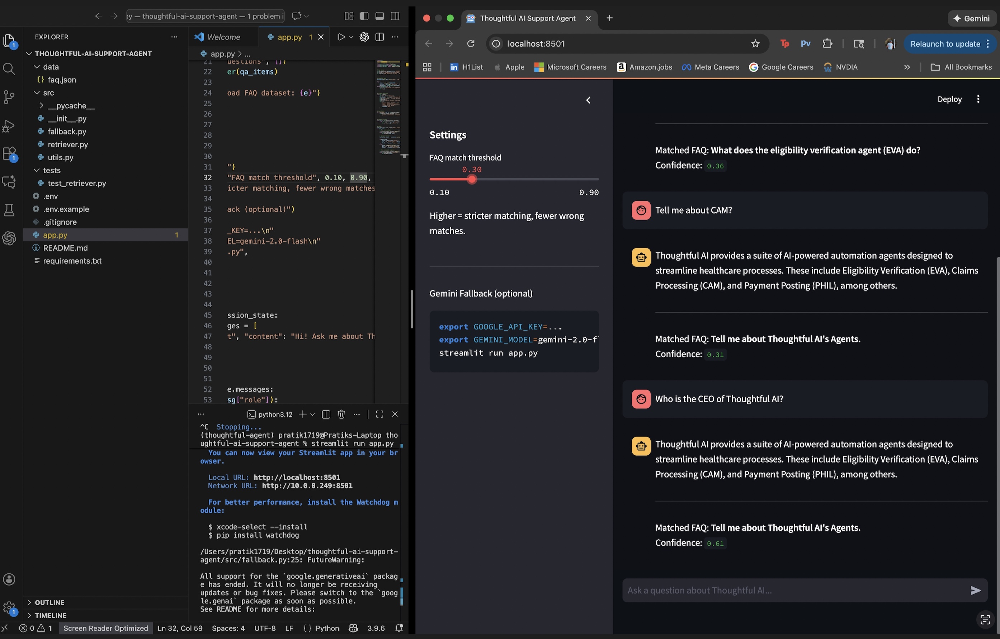

# Thoughtful AI — Customer Support Agent (FAQ Retrieval + Gemini Fallback)

A simple customer support agent that:
1) Retrieves the most relevant answer from a predefined FAQ dataset (TF-IDF + cosine similarity)
2) Falls back to Gemini (optional) when no strong match is found
3) Runs as a Streamlit chat UI

---

